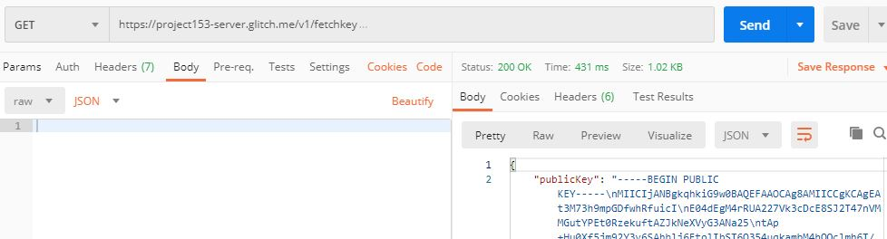
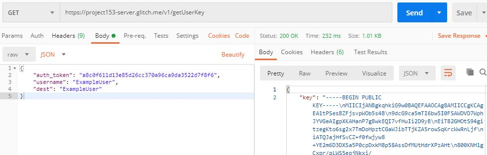
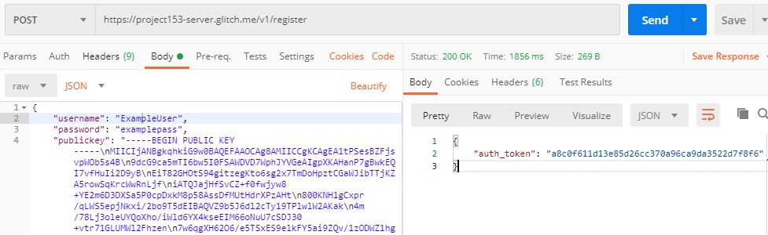
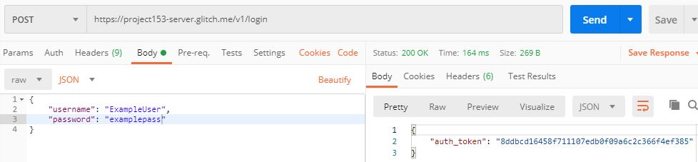
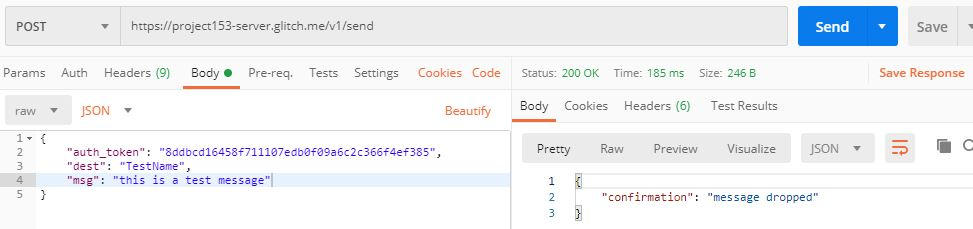
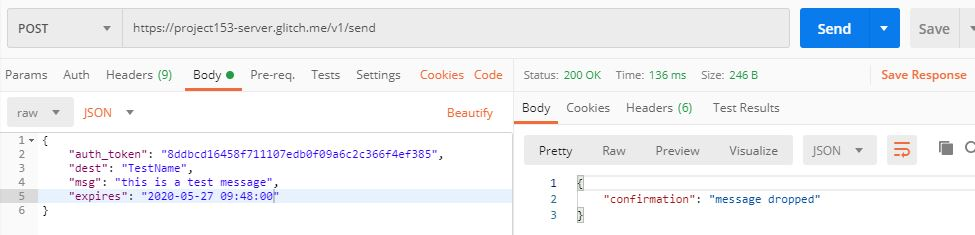
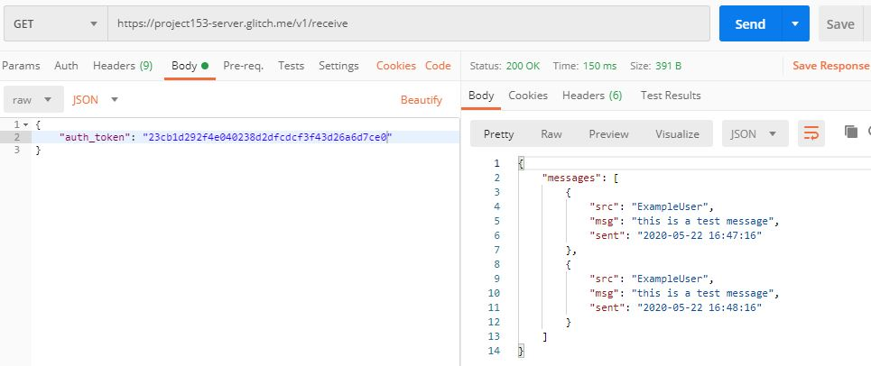
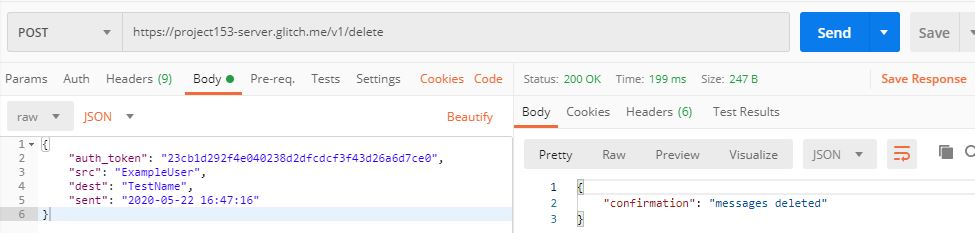
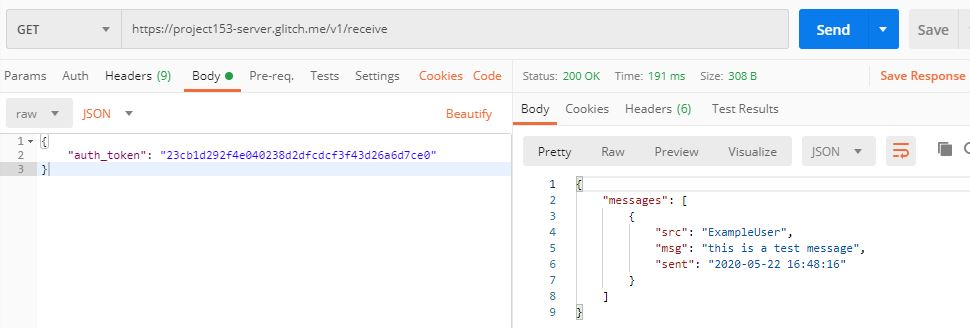

# Server for a chat app

### Overview

- The server receives requests with encrypted body messages, to conceal the contents from outsides. The encryption is asymmetric via public/private keys.
- The server doesn't reveal contact details:
  - When a message is received, the server autofills the sender values (not transmitted in the request).
  - When a client receives their messages they only see who sent the message (if someone obtains a message not intended for them they won't know the intended recipient).
- When a server receives a message, it simply stores it for when the recipient logs in and asks to receive their messages.
  - Messages are encrypted so that if database is broken into, messages still can't be read without access to the server's private key & algorithm
- The server doesn't forward or push to clients automatically, receiving messages happens when a user logs in to check their 'box'
  - This breaks the path between sender and receiver so that you can't follow a message from sender to server on to the recipient, only sender to server (and it's a guess about whether they're actually a sender or not).
- The server allows only one authenticated login for a user at any time, limiting where their messages get sent
  - One way to expand this project: with more time and a bigger team, this could be expanded to an ML-based prediction algorithm for expected or suspicious logins to better ensure user's security.

### Examples of expected request fields

Requests on the left, responses on the right

#### FetchKey

#### getUserKey

#### Register

#### Login

#### Send

Without the optional `expires` field

With the optional `expires` field

#### Receive

#### Delete

Result of a recieve after the deletion

#### Logout

